## amazon_goods-main
說明：利用 Selenium 自動化瀏覽器操作，抓取特定關鍵字商品的詳細資訊，包括價格、品牌、星等評價、尺寸與顏色選項等，並儲存成 CSV 檔案方便後續分析。
技術：Selenium + ChromeDriver、webdriver-manager（自動管理瀏覽器驅動）、pandas（資料整理與儲存）、re（正則表達式處理價格文字）

## 📊 成果簡報預覽
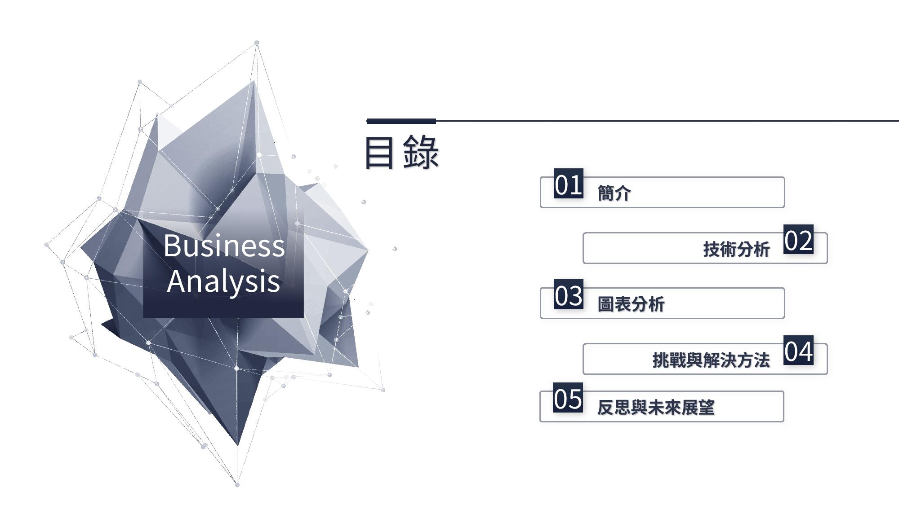
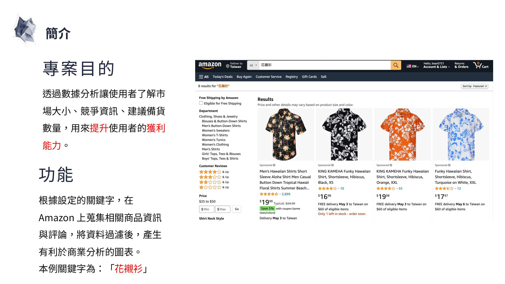
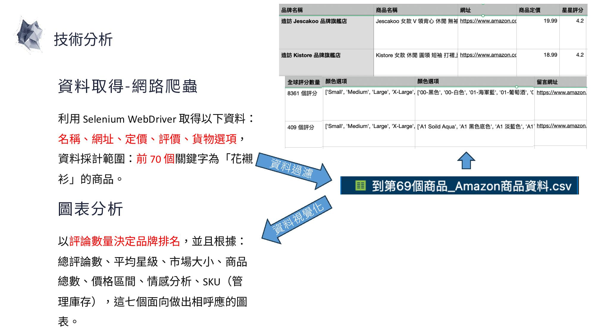
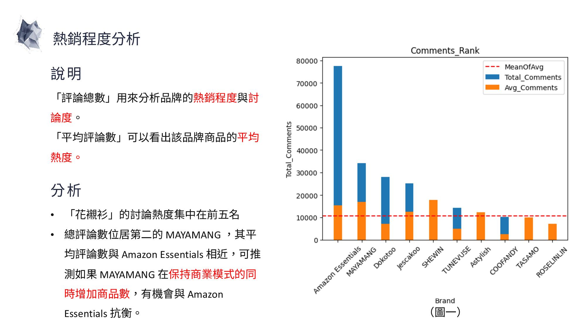
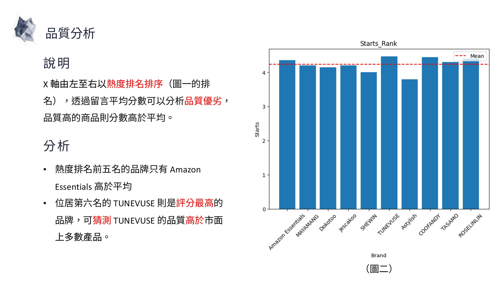
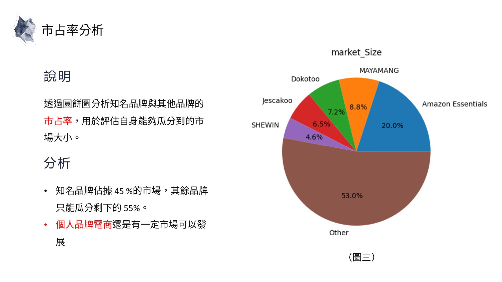
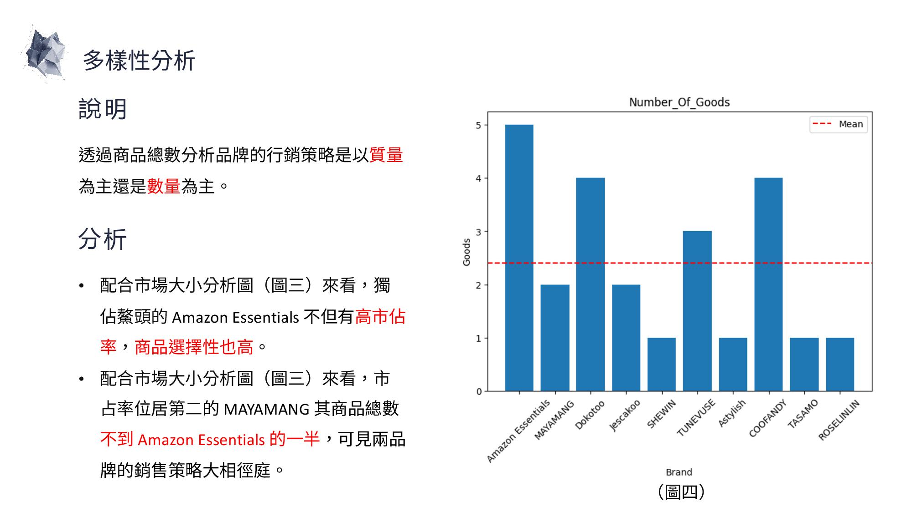
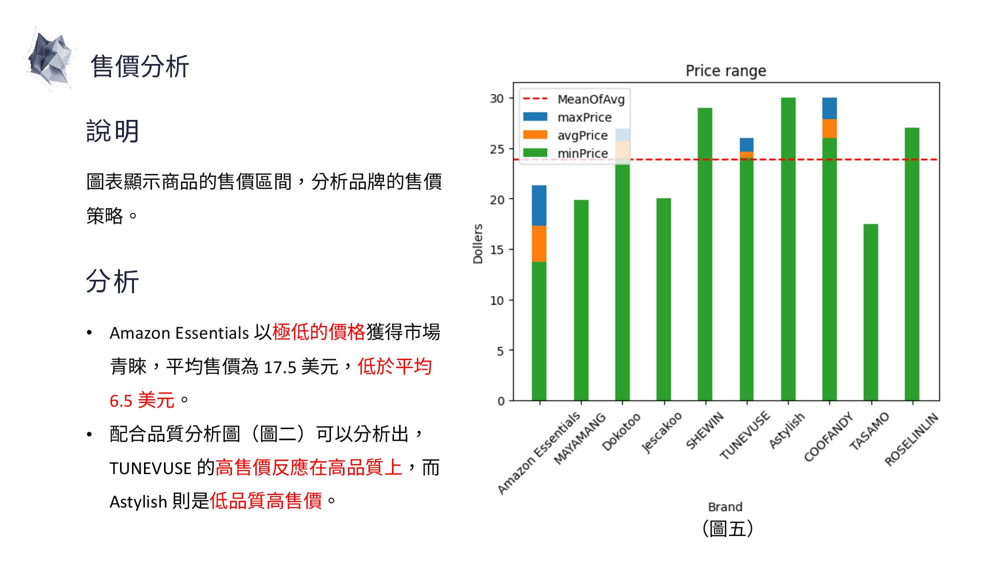
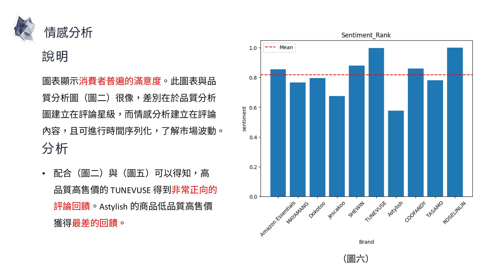
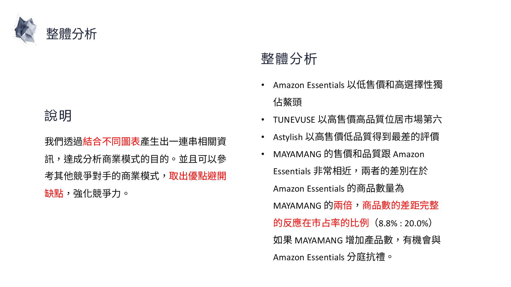
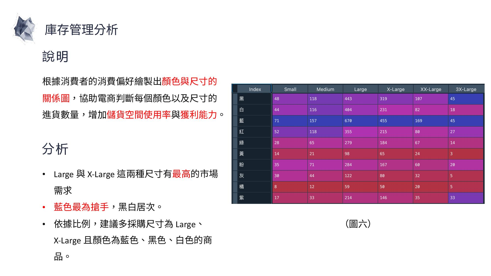
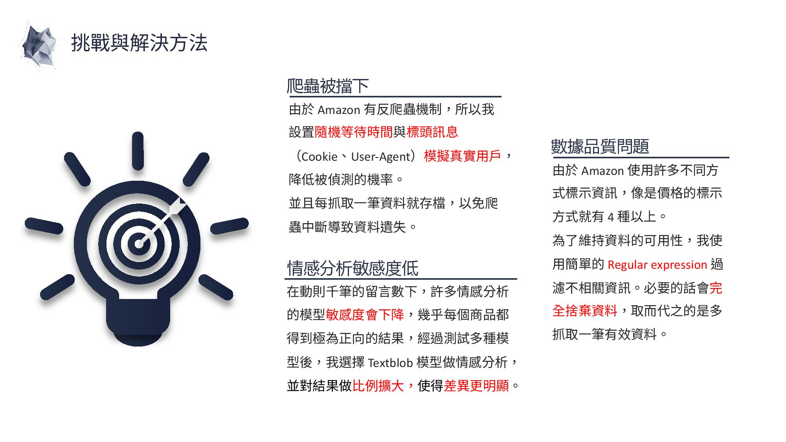
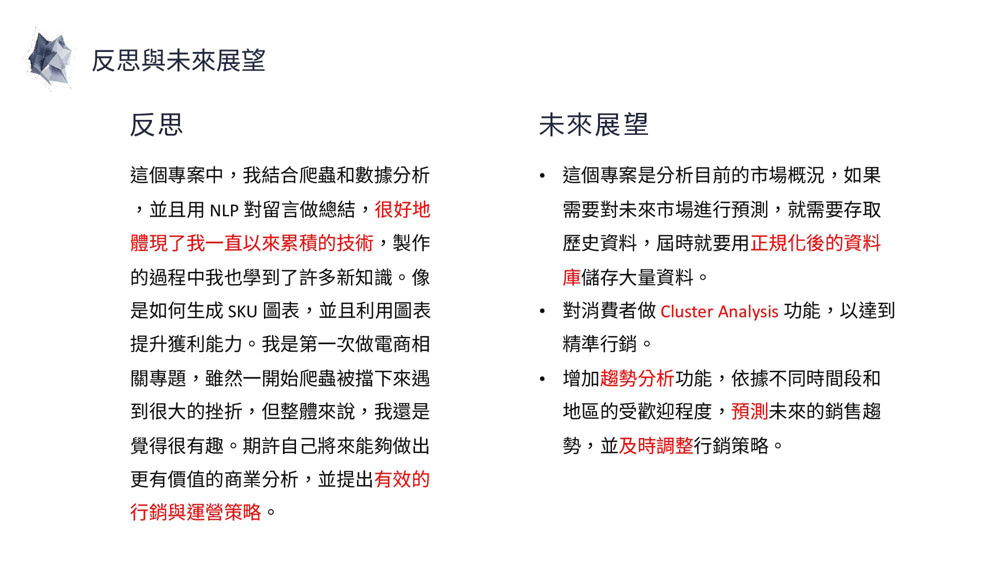

